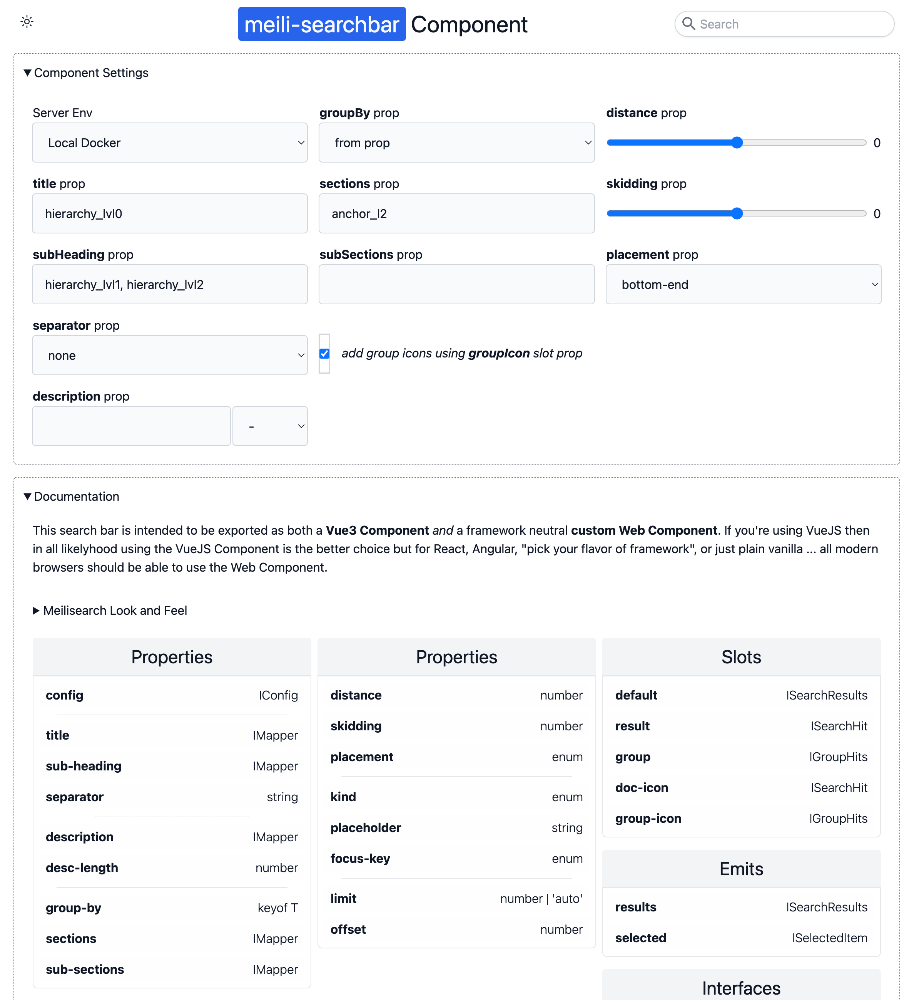

# `meili-searchbar` Component

A VueJS component (which is intended to be exported both as VueJS and framework neutral Web Component).

> Note: this repo was originally forked from `meilisearch/docs-searchbar.js` but is almost a complete departure from the original source code.

```bash
pnpm install
# playground application with docs
pnpm run dev
```

